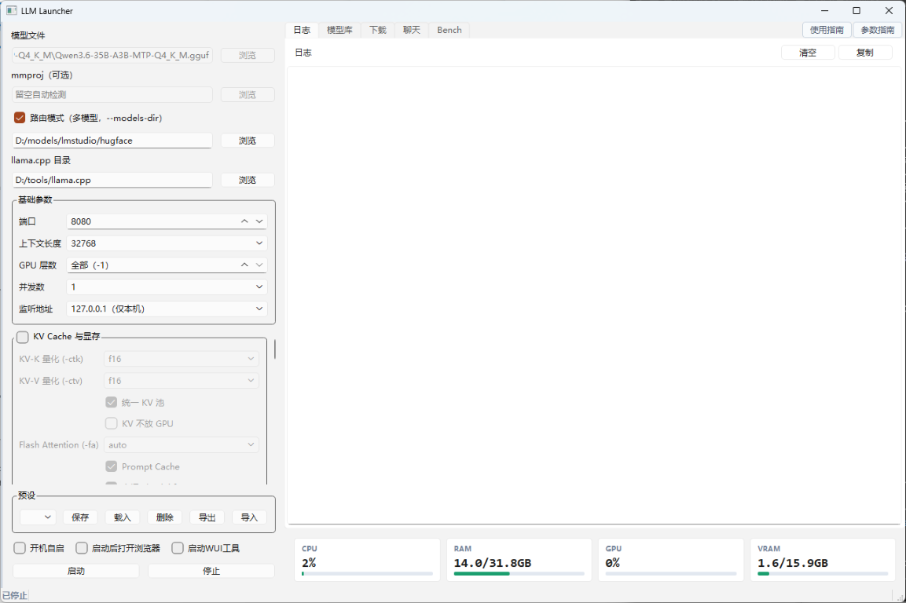
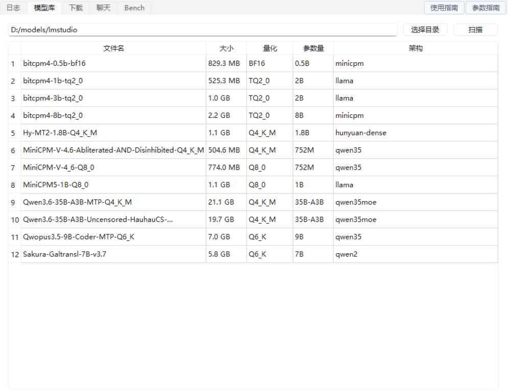
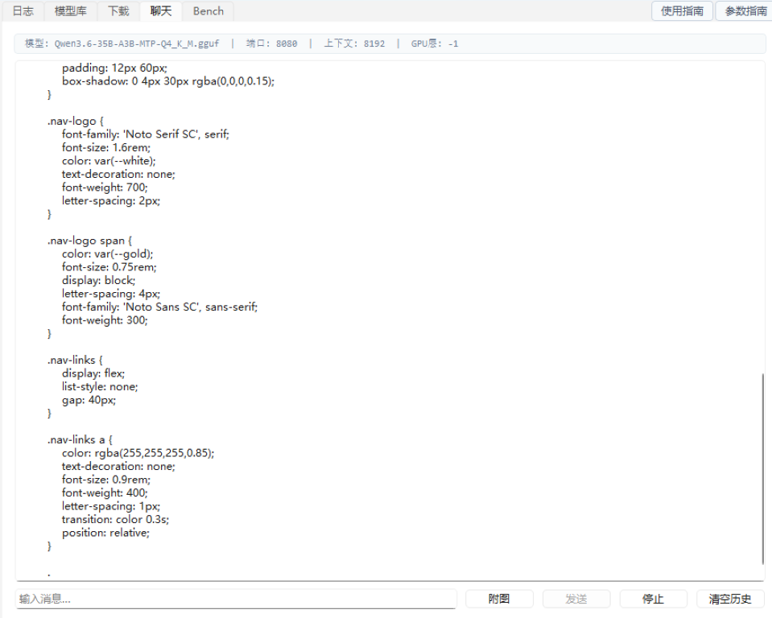
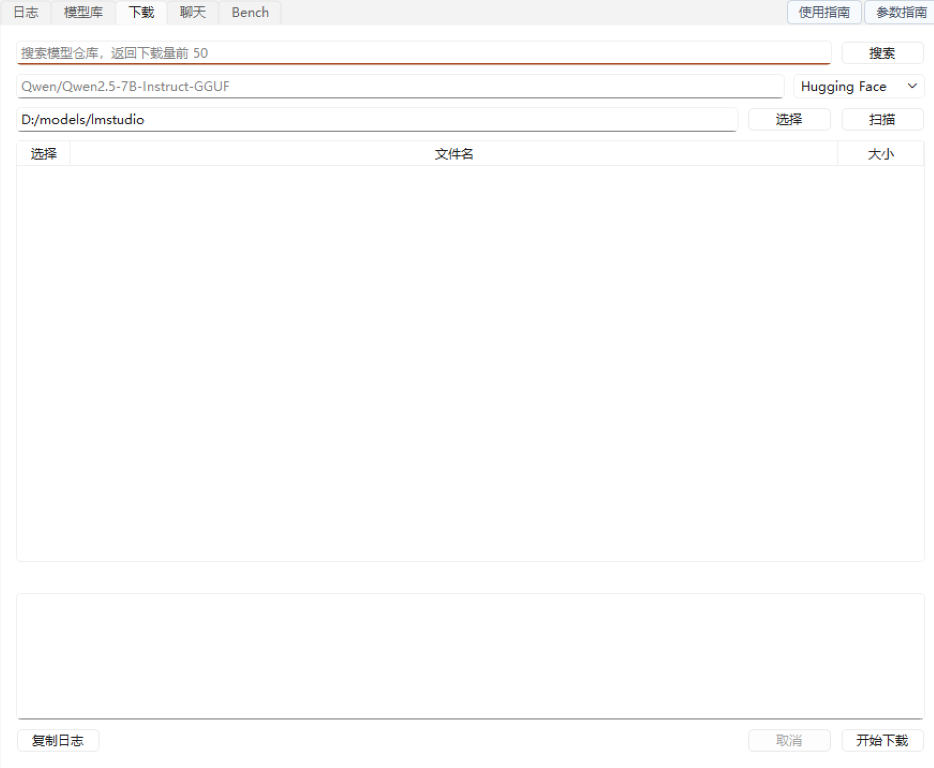
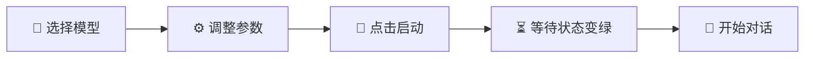

<div align="center">
  
  <h1 align="center">LLM Launcher</h1>
  <p align="center">
    本地大语言模型一键启动器 ·
    可视化配置 llama.cpp ·
    内置聊天测试与运行时监控
  </p>
  <p>
    
    
    
    
    
  </p>
</div>

---

## 界面预览

<div align="center">
  
  <br/>
  <b>📋 主界面</b> — 参数配置与服务控制
  <br/><br/>
  <table>
    <tr>
      <td align="center"></td>
      <td align="center"></td>
      <td align="center"></td>
    </tr>
    <tr>
      <td align="center"><b>📚 模型库</b> — 一键切换</td>
      <td align="center"><b>💬 内置聊天</b> — 即用即测</td>
      <td align="center"><b>⬇️ 搜索下载</b> — 多源下载</td>
    </tr>
  </table>
</div>

---

## 功能一览

<div align="center">

| | | |
|---|---|---|
| 🖥️ **模型选择**<br/>文件浏览器选择 .gguf，自动检测 mmproj | 🔄 **路由模式**<br/>多模型路由启动，支持 256K 上下文 | ⚙️ **参数配置**<br/>基础参数 + 30+ 高级参数分组折叠 |
| 🚀 **启停管理**<br/>一键启动/停止，状态实时反馈 | 📊 **进程监控**<br/>GPU 占用、内存、请求数实时显示 | 📚 **模型库**<br/>扫描目录，展示参数量/量化/架构 |
| ⬇️ **搜索下载**<br/>HF / HF 镜像 / ModelScope 多源 | 💬 **内置聊天**<br/>直接测试 API，支持图片多模态 | 🏎️ **性能测试**<br/>llama-bench 基准测试，多模型对比 |
| 💾 **预设管理**<br/>保存/载入/导入/导出参数预设 | 🪟 **系统托盘**<br/>最小化到托盘，右键快速操作 | 🔛 **开机自启**<br/>一键设置 Windows 开机启动 |
| 🌐 **WUI 工具**<br/>启用 llama-server Web 工具界面 | | |

</div>

---

## 🚀 快速开始

### 获取程序

本软件编译为独立 exe 文件分发，**无需安装 Python 环境**。下载解压后直接运行 `LLM Launcher.exe`。

**前置条件：**
- ✅ Windows 10/11
- ✅ [llama.cpp](https://github.com/ggml-org/llama.cpp) 已编译（含 `llama-server.exe` 和 `llama-bench.exe`）
- ✅ 至少一个 `.gguf` 格式的模型文件

### 基本使用流程



**详细步骤：**

1. **选择模型** — 左侧面板「模型文件」→ 点击「浏览」→ 选择 `.gguf` 文件
2. **（可选）设置 llama.cpp 目录** — 如果 `llama-server.exe` 不在 PATH 中，需指定目录
3. **调整参数** — 基础参数通常保持默认即可
4. **启动** — 点击「启动」按钮，日志面板显示服务器输出
5. **等待就绪** — 左侧状态线变绿 = 服务就绪，浏览器自动打开 Web UI
6. **停止** — 点击「停止」按钮

### 路由模式（多模型）

> [!TIP]
> 路由模式下同时加载多个模型，请求时通过 `"model"` 字段路由到对应模型。

勾选左侧面板「路由模式」→ 选择模型文件所在的上一级目录 → 启动。服务器自动扫描目录中的 GGUF 模型，通过 `--models-dir` 以路由模式启动。

- 请求中指定 `"model"` 字段路由到对应模型
- `/v1/models` 列出所有可用模型及其状态
- 路由模式下上下文长度选项自动扩展至 256K

### 搜索与下载模型

在「下载」Tab 输入关键词 → 选择数据源（HuggingFace / HF 镜像 / ModelScope）→ 点击「搜索」。返回下载量前 50 的仓库，双击结果自动填入仓库 ID，再点击「扫描」获取文件列表。

### 从源码运行（开发者）

```bash
# 安装依赖
pip install PySide6 psutil pyyaml requests huggingface-hub

# 启动
python main.py
```

> [!NOTE]
> 首次启动会自动在程序目录创建 `config.yaml` 配置文件。

---

## ⚙️ 参数说明

### 基础参数

| 参数 | 默认值 | 说明 |
|------|--------|------|
| 端口 | 8080 | HTTP 服务监听端口 |
| 上下文长度 | 32768 | 模型单次处理的最大 token 数 |
| GPU 层数 | -1（全部） | 卸载到 GPU 的层数，-1=全部，0=纯 CPU |
| 并发数 | 1 | 同时处理的请求数，每个 slot 独占 KV Cache |
| 监听地址 | 127.0.0.1 | 仅本机访问；改为 0.0.0.0 允许局域网 |

### 高级参数

高级参数按分组折叠显示，**默认不传入命令行**（使用 llama.cpp 内置默认值）。展开并修改后才生效。

| 分组 | 包含参数 |
|------|----------|
| 🧠 KV Cache 与显存 | KV 量化、统一 KV 池、Flash Attention、Prompt Cache 等 |
| ⚡ 推理速度 | 线程数、批大小、HTTP 线程、预热控制 |
| 🎯 采样参数 | 温度、Top-K/P、Min-P、重复惩罚、随机种子 |
| 🤔 思考/推理模式 | 思考模式开关、格式、预算（用于 DeepSeek-R1 等模型） |
| 🖼️ 多模态 | 视觉编码器 GPU 卸载、图像 token 范围 |
| 🔒 安全与访问控制 | API Key、超时、监控端点 |

> 详细的参数说明请在软件内点击右上角「参数指南」按钮查看。

---

## 💾 预设管理

- **保存** — 调整好参数后点击「保存」→ 输入预设名称
- **载入** — 从下拉列表选择预设 → 点击「载入」
- **导入/导出** — JSON 格式，方便在不同机器间迁移配置

---

## 🏎️ 性能测试 (Bench)

「Bench」Tab 基于 llama.cpp 自带的 `llama-bench.exe`，可对模型进行标准化基准测试。

### 使用流程

1. **添加模型** — 从模型库下拉选择 → 点击「添加到列表」（可添加多个模型进行对比）
2. **配置参数** — 设置历史缓存、输入长度、生成长度、Batch Size、GPU 层数等
3. **运行** — 点击「运行」，下方实时输出测试日志
4. **查看结果** — md 格式会自动解析为汇总表格，显示 prompt 处理速度和生成速度

### 参数组合示例

| 场景 | ngl | -d | -p | -n | 说明 |
|------|-----|----|----|----|----|
| 纯生成速度 | 99 | 0 | 512 | 128 | 测试模型的解码速度 |
| 长上下文影响 | 99 | 0,32768 | 1024 | 256 | 对比有无历史缓存时的速度差异 |
| CPU vs GPU | 0,99 | 0 | 512 | 128 | 对比纯 CPU 和全 GPU 的速度差距 |
| KV 量化对比 | 99 | 0 | 512 | 128 | 分别设 f16 和 q8_0 对比显存与速度 |

---

## ❓ 常见问题

> [!WARNING]
> **显存不足 (OOM)** — 降低上下文长度 → 减少 GPU 层数 → KV 量化 q8_0 → 关闭 Flash Attention

> [!TIP]
> **输出重复** — 增大重复惩罚（默认 1.10）或增大检查窗口 `--repeat-last-n`

| 问题 | 解决方案 |
|------|----------|
| **长对话截断** | 开启「上下文滑动」或增大上下文长度 |
| **端口被占用** | 换一个端口，或关闭占用该端口的程序 |
| **找不到 llama-server** | 在左侧面板指定 llama.cpp 目录，或将 llama-server.exe 所在目录加入 PATH |
| **路由模式启动失败** | 确认模型目录存在且包含 .gguf 文件，llama.cpp 版本需支持 `--models-dir`（2025-11 之后） |
| **搜索无结果** | 检查网络连接；HF 镜像源可切换至 HuggingFace；ModelScope 搜索结果可能不含 GGUF 标注，需手动确认 |
| **局域网无法访问** | 监听地址改为 `0.0.0.0`，检查防火墙，建议设置 API Key |
| **模型加载慢** | 启用 mmap（默认开启），使用 SSD 存放模型文件 |

---

## 🔧 技术栈

<div align="center">


</div>

---

## 📁 项目结构

```
llm-launcher/
├── main.py                      # 入口文件
├── core/
│   ├── config.py                # 配置读写 (ConfigStore)
│   ├── process_manager.py       # llama-server 进程管理（含路由模式）
│   ├── model_library.py         # 模型扫描与 GGUF 解析
│   ├── model_resolver.py        # llama-server 路径查找
│   ├── hf_downloader.py         # HuggingFace / ModelScope 下载与搜索
│   └── events.py                # 事件总线
├── ui/
│   ├── app.py                   # 主窗口布局
│   ├── control_panel.py         # 左侧控制面板
│   ├── log_panel.py             # 日志面板
│   ├── bridge.py                # 事件桥接 (QObject 信号)
│   ├── confirm_dialog.py        # 确认对话框
│   └── widgets/
│       ├── chat_panel.py        # 聊天测试面板
│       ├── monitor_panel.py     # 运行时监控面板
│       ├── model_library_panel.py # 模型库面板
│       ├── download_panel.py    # 下载面板
│       ├── bench_panel.py       # 性能测试面板
│       ├── param_groups.py      # 高级参数分组组件
│       ├── guide_panel.py       # 参数指南面板
│       └── usage_guide_panel.py # 使用指南面板
│       └── tray_icon.py         # 系统托盘图标
├── assets/                      # 图标、主题等资源
├── docs/                        # 设计文档与参数指南
└── tests/                       # 单元测试
```

---

## 📦 编译打包

项目通过 Nuitka 编译为独立 exe 分发（C++ 编译，无需 Python 运行时）：

```bash
# 使用项目内置编译脚本
C编译.bat
```

编译产物输出到 `dist/llm-launcher.exe`，包含资源文件和默认配置，可直接分发。

---

## 🌐 相关资源

- [llama.cpp 官方仓库](https://github.com/ggml-org/llama.cpp)
- [GGUF 模型格式说明](https://github.com/ggml-org/ggml/blob/master/docs/gguf.md)
- [HuggingFace GGUF 模型](https://huggingface.co/models?sort=trending&search=gguf)

---

<div align="center">
  <sub>用 ❤️ 和 🤖 构建 | Licensed under MIT</sub>
</div>
